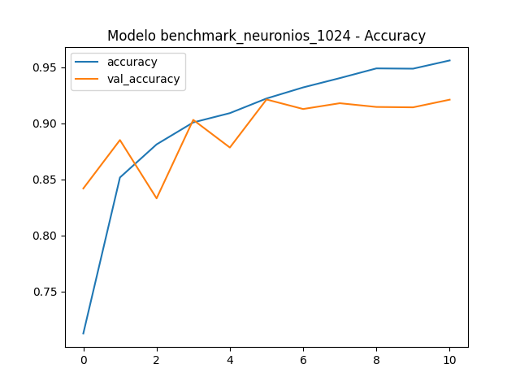

# Machine Learning em Reconhecimento de Esboços

> Classificador de desenhos à mão (*doodles*) no estilo **Google Quick, Draw!**, treinado do zero com CNN — acompanhado de um estudo de dimensionalidade (PCA + Regressão Logística) e de uma investigação sobre **viés cultural** em visão computacional.


---

## Visão geral

Projeto desenvolvido na disciplina de **Machine Learning** com o objetivo de reconhecer esboços feitos à mão a partir do dataset **Google Quick, Draw!**. Em vez de parar no "modelo que classifica desenhos", o trabalho se divide em três frentes complementares:

1. **CNN treinada do zero** — o modelo principal, que atinge **~92% de acurácia de validação** em 10 classes.
2. **Estudo de dimensionalidade** — PCA + Regressão Logística para entender quanta informação é realmente necessária para classificar um esboço.
3. **Estudo de viés cultural** — treinar modelos com desenhos de diferentes países e medir como o desempenho degrada *fora da distribuição de origem*.

> Projeto acadêmico, publicado como registro do trabalho da disciplina e para fins de portfólio.

---

## Principais resultados

- **CNN (modelo final):** ~**92%** de acurácia de validação em 10 classes, treinada do zero (sem redes pré-treinadas).
- **Framework de benchmark próprio:** varredura sistemática de nº de blocos convolucionais, nº de neurônios, nº de camadas densas, otimizadores (Adam / SGD / AdamW) e volume de dados — sempre cruzando **acurácia × loss × tempo de treino**.
- **PCA + Regressão Logística:** reduzir a dimensão dos dados **melhorou** a classificação em relação ao baseline de 4096 pixels (0.54) e a acurácia **satura por volta de 50 componentes** — com treino muito mais rápido.
- **Viés cultural:** modelos "locais" generalizam mal globalmente. A acurácia *out-of-distribution* variou de **78% (US)** a **53% (RU)**, evidenciando que diversidade de dados é um requisito **técnico**, não apenas ético.

---

## Dataset

- **Fonte:** Google *Quick, Draw!* (obtido via Kaggle).
- **Classes (10):** `duck`, `drums`, `tree`, `megaphone`, `dog`, `piano`, `hot dog`, `door`, `hat`, `hurricane`.
- **Pré-processamento:** imagens originais 255×255 → redimensionadas para **64×64**, convertidas para **escala de cinza** (4096 features).
- **Split:** treino/teste **80/20**.

> As classes utilizadas em cada experimento ficam versionadas em `words_to_keep.json` e `words_to_keep_cultural.json`.

---

## Arquitetura do modelo (CNN)

Modelo final: **3 blocos convolucionais + 2 camadas densas de 1024 neurônios**, construído manualmente com a API `Sequential` do Keras.

```python
def create_cnn_2_1024_3_blocos(input_shape, num_classes):
    model = models.Sequential()

    # Bloco 1
    model.add(layers.Conv2D(32, (3, 3), activation='relu', input_shape=input_shape))
    model.add(layers.MaxPooling2D((2, 2)))

    # Bloco 2
    model.add(layers.Conv2D(64, (3, 3), activation='relu'))
    model.add(layers.MaxPooling2D((2, 2)))

    # Bloco 3
    model.add(layers.Conv2D(64, (3, 3), activation='relu'))
    model.add(layers.MaxPooling2D((2, 2)))

    model.add(layers.Flatten())

    model.add(layers.Dense(1024, activation='relu'))
    model.add(layers.Dropout(0.3))
    model.add(layers.BatchNormalization())

    model.add(layers.Dense(1024, activation='relu'))
    model.add(layers.Dropout(0.3))
    model.add(layers.BatchNormalization())

    model.add(layers.Dense(num_classes, activation='softmax'))

    model.compile(
        optimizer='adam',
        loss='categorical_crossentropy',
        metrics=['accuracy'],
    )
    return model
```

- **Entrada:** `64×64×1` (grayscale) · **Saída:** 10 classes (`softmax`)
- **Otimizador:** Adam · **Loss:** categorical crossentropy
- **Regularização:** Dropout (0.3) + BatchNormalization nas camadas densas



---

## Benchmarks

Cada hiperparâmetro foi isolado e avaliado por **acurácia de validação, val loss e tempo de treino**, para escolher a configuração com o melhor custo-benefício (e não apenas a maior acurácia bruta).

**Blocos convolucionais**

| Blocos | Val Accuracy | Val Loss | Tempo de treino |
|:------:|:------------:|:--------:|:---------------:|
| 2 | 0.906 | 0.323 | 824.0 s |
| **3** | **0.922** | **0.254** | **167.3 s** |
| 4 | 0.884 | 0.367 | 97.5 s |

**Neurônios por camada densa**

| Neurônios | Val Accuracy | Val Loss | Tempo de treino |
|:---------:|:------------:|:--------:|:---------------:|
| 256 | 0.915 | 0.278 | 140.5 s |
| 512 | 0.916 | 0.273 | 143.6 s |
| **1024** | **0.921** | **0.257** | 175.5 s |
| 2048 | 0.917 | 0.293 | 589.8 s |

**Nº de camadas densas** → melhor equilíbrio em **3 camadas** (0.925 / 0.246), com 4 já dando sinais de piora.
**Otimizador** → Adam, SGD e AdamW ficaram todos em torno de **~92%**, com Adam entregando o menor tempo.
**Volume de dados** → acurácia sobe de **~83%** (480 imagens) para **~92%** (2160 imagens), confirmando que o gargalo era quantidade de dados.

> **Configuração vencedora:** 3 blocos convolucionais · 1024 neurônios · Adam.

---

## Estudo de dimensionalidade (PCA + Regressão Logística)

Antes da CNN, investigamos quanta dimensionalidade é realmente necessária, aplicando **PCA** e treinando uma **Regressão Logística** sobre os componentes principais.

| Dimensões | Acurácia (teste) | Variância explicada |
|:---------:|:----------------:|:-------------------:|
| 4096 (todas) | 0.542 | — |
| 10 | 0.614 | 0.089 |
| 20 | 0.651 | 0.123 |
| 30 | 0.664 | 0.148 |
| 50 | 0.681 | 0.189 |
| 100 | 0.689 | 0.267 |
| 200 | 0.695 | 0.378 |

**Achados:** reduzir a dimensão **melhorou** o desempenho frente ao baseline de 4096 px; a acurácia satura em torno de **50 componentes**; e o treino fica ordens de grandeza mais rápido.

---

## Estudo de viés cultural

O *Quick, Draw!* é dominado por Estados Unidos e Grã-Bretanha (milhares de desenhos por classe), enquanto países como Brasil e Rússia sofrem com escassez de dados. Investigamos o impacto disso: treinamos modelos com desenhos de um país e medimos como eles classificam os desenhos do **resto do mundo**.

**Acurácia global (out-of-distribution) por país de treino:**

| País | Acurácia |
|:----:|:--------:|
| 🇺🇸 US | 78.13% |
| 🇬🇧 GB | 72.62% |
| 🇩🇪 DE | 67.94% |
| 🇨🇦 CA | 65.18% |
| 🇧🇷 BR | 61.68% |
| 🇷🇺 RU | 52.76% |

**Conclusão:** o viés local se traduz em **falha de generalização global**. Diversidade de dados deixa de ser só uma questão ética e passa a ser um **requisito técnico e matemático** — diretamente ligado à prevenção de *model decay* em ambientes de produção.

---

## Estrutura do repositório

```
Projeto-Machine-Learning/
├── training.py / training2.py / train_test.py   # Treino da CNN e pipeline treino/teste
├── run.py / run2.py                             # Execução dos experimentos
├── comparar_modelos.py                          # Benchmark/comparação entre modelos
├── testar_modelo.py / teste.py / teste_novo.py  # Testes e inferência
├── predicao.py                                  # Predição em novas imagens
├── treinar_vies_cultural.py                     # Treino dos modelos por país
├── run_vies_cultural.py / avaliar_mundo.py      # Avaliação cross-cultural (viés)
├── estudo_dimensoes_RL/                         # PCA + Regressão Logística
├── Benchmarks/ · comparacoes/ · metricas/       # Resultados, gráficos e métricas
├── notebooks/                                   # Notebooks de exploração
├── treatments/ · utils/                         # Pré-processamento e utilitários
├── materiais/ · apresentacoes/                  # Slides e materiais de apoio
├── words_to_keep.json / words_to_keep_cultural.json  # Classes selecionadas
├── requirements.txt · .python-version           # Ambiente
└── LICENSE
```

> *As descrições acima seguem a nomenclatura dos scripts — ajuste conforme o conteúdo exato de cada arquivo, se necessário.*

---

## Reprodutibilidade

O repositório serve de registro dos experimentos da disciplina. Para reproduzi-los localmente (requer **Python 3.12**, ver `.python-version`):

```bash
# 1. Clone o repositório
git clone https://github.com/O-Jucas/Projeto-Machine-Learning.git
cd Projeto-Machine-Learning

# 2. Crie e ative um ambiente virtual
python -m venv .venv
source .venv/bin/activate        # Windows: .venv\Scripts\activate

# 3. Instale as dependências
pip install -r requirements.txt

# 4. Execute um experimento (exemplos)
python run.py                    # pipeline principal
python comparar_modelos.py       # benchmark entre configurações
python run_vies_cultural.py      # estudo de viés cultural
```

Principais bibliotecas: `tensorflow` · `keras` · `scikit-learn` · `numpy` · `pandas` · `matplotlib` · `opencv-python`.

---

## Stack

- **Linguagem:** Python 3.12
- **Deep Learning:** TensorFlow / Keras
- **ML clássico:** scikit-learn (PCA, Regressão Logística)
- **Dados & visualização:** NumPy, pandas, Matplotlib, OpenCV

---

## Time

Projeto em grupo. Papéis conforme a divisão do trabalho:

| Integrante | Frente principal |
|------------|------------------|
| **Lucas Vargas** ([@O-Jucas](https://github.com/O-Jucas)) | Benchmarks: nº de camadas, neurônios, otimizadores e volume de dados |
| **Diogo Lima** ([@brunora16](https://github.com/dbclima)) | Benchmarks e parte teórica |
| **Renan Guedes** ([@RenanMguedes](https://github.com/RenanMguedes))| Estudo do comportamento das dimensões da imagem (PCA) |
| **Bruno Rodrigues** ([@dbclima](https://github.com/brunora16)) | Estudo de viés cultural (desenho × país) |
| **Gabriela Vilar** | Questionamentos sobre o modelo (pré-treino, camadas congeladas) |

---

## Licença

Distribuído sob a licença **MIT**. Veja [`LICENSE`](LICENSE) para mais detalhes.
